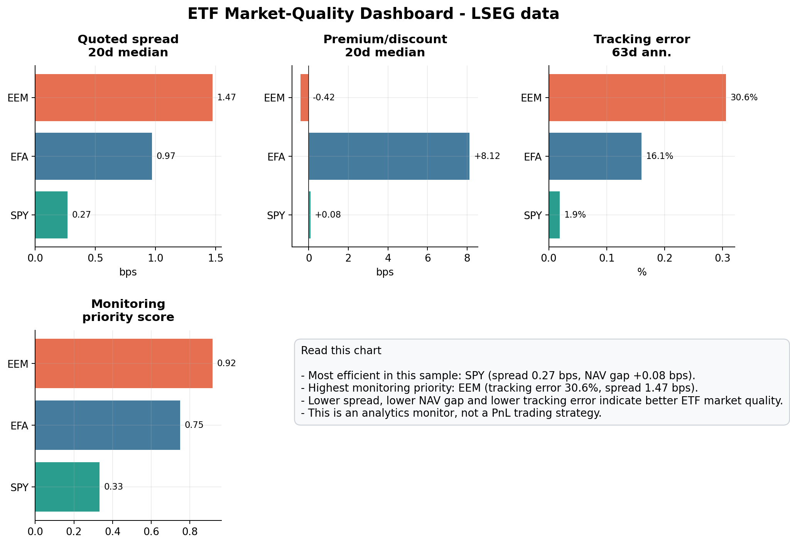
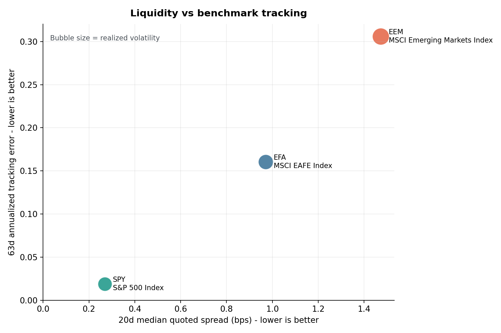
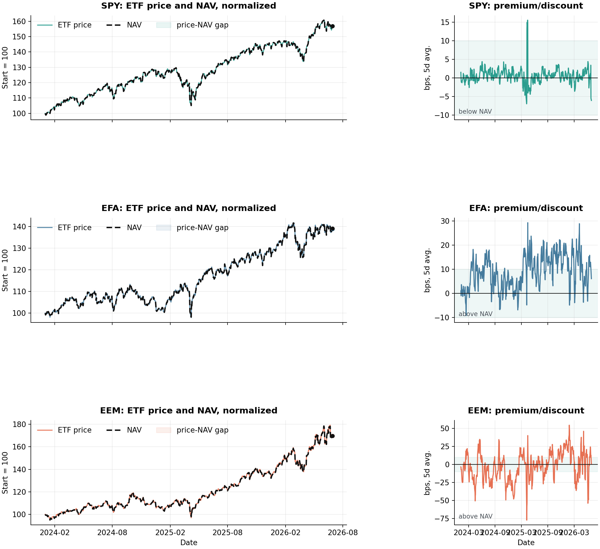
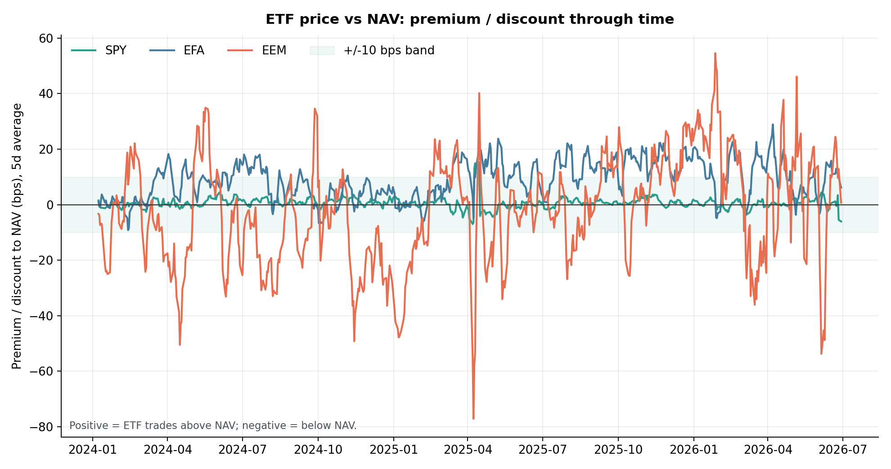

# Euronext ETF Quant Lab

Production-style ETF analytics project built for market-structure, ETF strategy and quant research interviews.

It uses local LSEG daily market-data caches and produces reproducible reports for the exact project themes listed on my CV:

1. ETF Market-Quality & Fair-Value Analytics
2. Simulation & Scenario Models
3. Optimization & Segmentation
4. Market-Data Analytics & Dashboards
5. Quantitative Market Research
6. Quantitative Toolkit

## Quick start

```bash
pip install -r requirements.txt
python scripts/run_all.py
pytest
```

Generated outputs are written to `reports/` and `data/processed/`.

Raw LSEG / Refinitiv data is not committed to this repository. See `DATA_LICENSE_NOTE.md`.

For the ETF market-quality project:

```bash
python scripts/pull_project1_lseg.py --rics SPY,EFA,EEM --with-nav --out data/raw_lseg_project1_nav_core
python scripts/audit_project1_benchmarks_lseg.py --etfs SPY,EFA,EEM,DIA,IWM,XLK,XLF,XLE
python scripts/run_project1_market_quality.py --lseg-folder data/raw_lseg_project1_nav_core
python scripts/plot_project1_market_quality.py
pytest -q
```

## Data

The loader reads LSEG cache files from:

```text
../data/capability_audit/raw_prices
```

The current local cache contains daily close-like fields (`TRDPRC_1`) for ETFs, indices, volatility indices and correlation indices. The market-quality module also supports true `BID`, `ASK`, `NAV` and volume fields when they are available from LSEG Workspace.

When those fields are absent, the report is explicit and uses price-based liquidity/stress proxies instead of pretending to have bid/ask or NAV data.

## Project map to CV

### ETF Market-Quality & Fair-Value Analytics

`scripts/run_project1_market_quality.py` computes quoted bid-ask spread, premium/discount to NAV, tracking error versus mapped LSEG benchmarks, beta, realized volatility, drawdown and market-quality risk score.

Output:

- `reports/project1_market_quality.md`
- `reports/figures/project1/market_quality_dashboard.png`
- `reports/figures/project1/liquidity_vs_tracking.png`
- `reports/figures/project1/premium_discount_timeseries.png`
- `reports/figures/project1/spread_timeseries.png`
- `reports/figures/project1/nav_alignment_detail.png`
- `reports/figures/project1/normalized_price_vs_nav.png`
- `data/processed/project1_market_quality.csv`
- `config/project1_benchmarks.csv`

This is an ETF analytics and monitoring project, not a PnL trading strategy. The goal is to detect whether an ETF trades efficiently: tight spreads, small NAV gap, reasonable liquidity and stable benchmark tracking.









### Simulation & Scenario Models

`scripts/run_scenarios.py` runs block-bootstrap Monte Carlo, market stress scenarios, transaction-cost sensitivity and fee/revenue sensitivity.

Output:

- `reports/scenario_models_report.md`
- `data/processed/scenario_stress_tests.csv`
- `data/processed/fee_revenue_sensitivity.csv`

### Optimization & Segmentation

`scripts/run_optimization.py` builds an inverse-volatility risk-parity allocator with volatility targeting, max-weight constraints and turnover costs.

Output:

- `reports/optimization_segmentation_report.md`
- `data/processed/vol_target_weights.csv`
- `data/processed/cluster_segmentation.csv`

### Market-Data Analytics & Dashboards

The generated CSV files are dashboard-ready snapshots: market quality, strategy weights, scenarios, cluster segmentation and research signals.

### Quantitative Market Research

`scripts/run_research.py` tests ETF relative-value z-scores, sector dispersion and volatility/correlation context using benchmark comparison and transaction costs.

Output:

- `reports/quant_market_research_report.md`
- `data/processed/relative_value_zscores.csv`
- `data/processed/sector_dispersion.csv`

### Quantitative Toolkit

`src/toolkit.py` contains Black-Scholes, CRR binomial pricing and walk-forward split utilities. `tests/test_metrics.py` validates core metrics and pricing convergence.

## Interview framing

This is not presented as a secret proprietary alpha. It is presented as an institutional-quality research and analytics framework:

- clean LSEG data ingestion
- explicit data limitations
- ETF market-quality analytics
- benchmark comparison
- no look-ahead in strategy returns
- transaction costs
- scenario stress testing
- reproducible reports and tests
