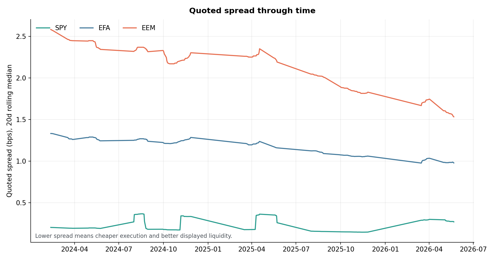
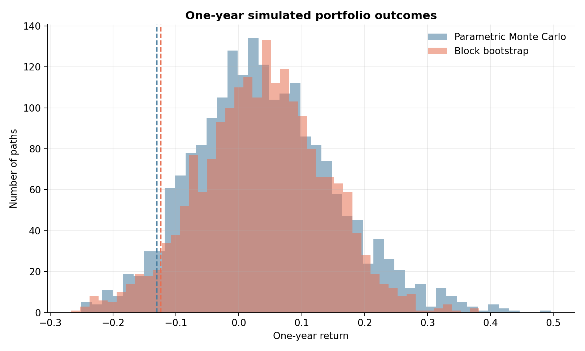
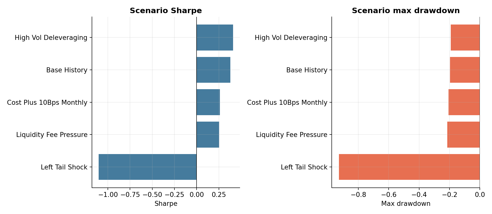
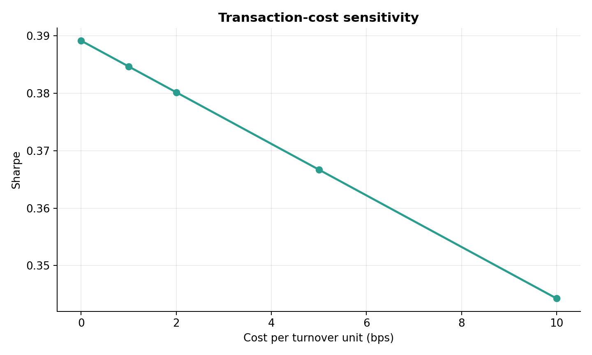
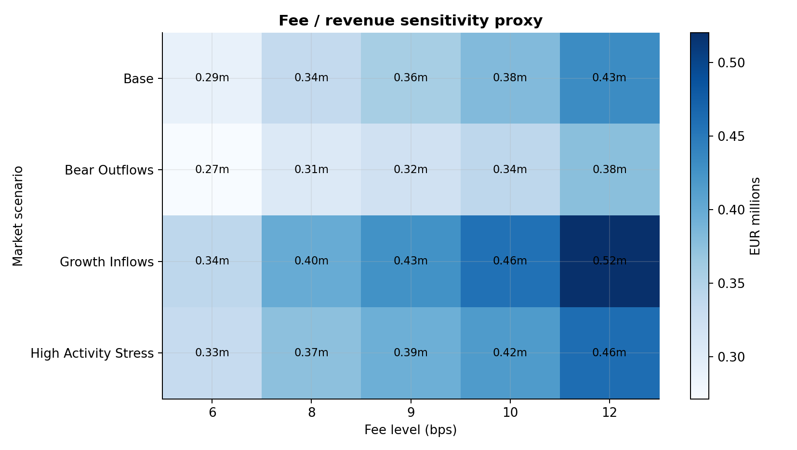

# Euronext ETF Quant Lab

ETF market-quality and fair-value analytics framework built in Python with LSEG Workspace data.

This project analyses how efficiently ETFs trade by combining market prices, bid/ask quotes, NAV data, benchmark returns, liquidity metrics and scenario analysis. The goal is to build a clean quantitative monitoring framework for ETF trading quality, pricing efficiency, tracking behaviour and market-risk diagnostics.

This is not a PnL trading strategy. It is a research and analytics project designed to understand ETF market quality.

---

## Project Overview

ETFs can temporarily trade away from their fair value because of liquidity conditions, market-maker activity, benchmark moves, bid/ask spreads, NAV timing, transaction costs and supply-demand imbalances.

This project measures those effects through a reproducible Python workflow:

* quoted bid-ask spread analysis;
* premium / discount to NAV;
* ETF price versus NAV alignment;
* benchmark mapping;
* tracking error versus benchmark;
* beta versus benchmark;
* realized volatility;
* maximum drawdown;
* liquidity and volume indicators;
* market-quality risk scoring;
* simulation and scenario stress testing;
* automated reports and figures.

The output is a ranked ETF monitoring framework that helps identify which ETFs trade tightly, which ETFs show wider spreads, and which ETFs experience higher tracking, liquidity or pricing risk.

---

## Main Features

### 1. ETF Market-Quality Metrics

The project computes core ETF trading-quality indicators:

| Metric                    | Purpose                                                      |
| ------------------------- | ------------------------------------------------------------ |
| Bid-ask spread            | Measures the quoted cost of trading the ETF                  |
| Premium / discount to NAV | Measures whether the ETF trades above or below its fund NAV  |
| Tracking error            | Measures deviation between ETF returns and benchmark returns |
| Beta                      | Measures ETF sensitivity to the mapped benchmark             |
| Realized volatility       | Measures return variability                                  |
| Maximum drawdown          | Measures downside stress                                     |
| Liquidity indicators      | Measures volume and trading activity                         |
| Market-quality risk score | Aggregates several signals into a simple monitoring score    |

### 2. Benchmark Mapping

Each ETF is mapped to a benchmark or proxy index.

The benchmark is used to compute:

* relative returns;
* tracking error;
* beta;
* benchmark-adjusted risk diagnostics.

When an exact benchmark is not available, the project uses a documented proxy and flags its quality in the benchmark mapping file.

### 3. LSEG Data Workflow

The project is designed to work with LSEG Workspace data.

When available, the workflow pulls:

* ETF last price;
* ETF bid price;
* ETF ask price;
* ETF volume;
* ETF fund NAV;
* benchmark price history.

The repository does not include raw LSEG / Refinitiv data. Users need their own LSEG Workspace access to reproduce live data pulls.

### 4. Price-Only Fallback Mode

The project supports two data modes.

**Full market-quality mode**

Uses bid, ask and NAV fields when available. This allows true quoted-spread and true premium / discount to NAV analysis.

**Price-only fallback mode**

Uses daily price-like fields when bid, ask or NAV fields are unavailable. In this mode, the project does not pretend to have true spread or NAV information. It focuses instead on price-based risk, tracking and liquidity-stress proxies.

---

## Repository Structure

```text
euronext-etf-quant-lab/
│
├── config/
│   └── project1_benchmarks.csv
│
├── reports/
│   ├── project1_market_quality.md
│   ├── market_quality_report.md
│   ├── project1_explanation_fr.md
│   └── figures/
│       ├── project1/
│       └── project2/
│
├── scripts/
│   ├── audit_project1_benchmarks_lseg.py
│   ├── plot_project1_market_quality.py
│   ├── pull_project1_lseg.py
│   ├── run_all.py
│   ├── run_market_quality.py
│   ├── run_optimization.py
│   ├── run_project1_market_quality.py
│   ├── run_research.py
│   └── run_scenarios.py
│
├── src/
│   ├── data.py
│   ├── lseg_pull.py
│   ├── market_quality.py
│   ├── metrics.py
│   ├── optimization.py
│   ├── project1_market_quality.py
│   ├── research.py
│   ├── simulation.py
│   └── toolkit.py
│
├── tests/
│   ├── test_metrics.py
│   └── test_simulation.py
│
├── DATA_LICENSE_NOTE.md
├── README.md
└── requirements.txt
```

---

# Project 1 — ETF Market-Quality Analytics

The main project computes ETF market-quality indicators from LSEG Workspace data.

The workflow measures whether an ETF trades efficiently by looking at:

* quoted spread;
* NAV premium / discount;
* price versus NAV alignment;
* benchmark tracking;
* beta;
* volatility;
* drawdown;
* liquidity indicators;
* market-quality risk score.

Main script:

```bash
python scripts/run_project1_market_quality.py
```

Optional live LSEG pull:

```bash
python scripts/pull_project1_lseg.py --rics SPY,EFA,EEM --with-nav --out data/raw_lseg_project1_nav_core
```

Optional benchmark audit:

```bash
python scripts/audit_project1_benchmarks_lseg.py --etfs SPY,EFA,EEM,DIA,IWM,XLK,XLF,XLE
```

Optional plotting script:

```bash
python scripts/plot_project1_market_quality.py
```

Main outputs:

* `reports/project1_market_quality.md`
* `reports/figures/project1/market_quality_dashboard.png`
* `reports/figures/project1/liquidity_vs_tracking.png`
* `reports/figures/project1/nav_alignment_detail.png`
* `reports/figures/project1/premium_discount_timeseries.png`
* `reports/figures/project1/spread_timeseries.png`
* `reports/figures/project1/normalized_price_vs_nav.png`
* `data/processed/project1_market_quality.csv`
* `config/project1_benchmarks.csv`

---

## Project 1 Figures

### ETF Market-Quality Dashboard

This dashboard summarizes the main market-quality indicators across the ETF sample.


### Liquidity vs Tracking

This figure compares ETF liquidity conditions with benchmark tracking behaviour.


### ETF Price vs NAV Alignment

This figure compares ETF market price behaviour with NAV alignment.


### Premium / Discount Through Time

This figure shows how the ETF premium / discount to NAV evolves through time.


### Quoted Spread Through Time

This figure shows the evolution of quoted bid-ask spreads through time.



### Normalized ETF Price vs NAV

This figure compares normalized ETF price and NAV series.


---

# Project 2 — Simulation & Scenario Models

The supporting project stress-tests ETF allocation and liquidity assumptions under different market conditions.

It uses:

* Monte Carlo simulation;
* block-bootstrap simulation;
* market-regime stress testing;
* volatility-targeted allocation logic;
* transaction-cost sensitivity;
* fee / revenue sensitivity proxies.

This module is not the core market-quality monitor. It is a supporting quantitative research block used to understand how ETF allocation and liquidity assumptions behave under different market scenarios.

Main script:

```bash
python scripts/run_scenarios.py
```

Main outputs:

* `reports/project2_simulation_scenario_models.md`
* `reports/figures/project2/terminal_distribution.png`
* `reports/figures/project2/scenario_stress_summary.png`
* `reports/figures/project2/cost_sensitivity.png`
* `reports/figures/project2/fee_revenue_heatmap.png`

The fee / revenue block is an illustrative sensitivity model, not an exact real-world fee schedule.

---

## Project 2 Figures

### Simulation Distribution

This figure shows the simulated distribution of terminal outcomes.



### Scenario Stress Summary

This figure compares outcomes across market scenarios.



### Cost Sensitivity

This figure shows how transaction-cost assumptions affect simulated outcomes.



### Fee / Revenue Sensitivity

This figure shows an illustrative fee / revenue sensitivity analysis.



---

## Methodology

The full workflow follows these steps:

1. Define the ETF universe.
2. Map each ETF to a benchmark or proxy benchmark.
3. Pull ETF and benchmark data from LSEG Workspace.
4. Clean and align time series.
5. Compute return-based metrics.
6. Compute ETF market-quality metrics.
7. Rank ETFs by market-quality risk.
8. Generate markdown reports.
9. Generate figures.
10. Run tests to validate core calculations.

---

## Quick Start

Install dependencies:

```bash
pip install -r requirements.txt
```

Run the full workflow:

```bash
python scripts/run_all.py
```

Run only the main ETF market-quality project:

```bash
python scripts/run_project1_market_quality.py
```

Run the scenario module:

```bash
python scripts/run_scenarios.py
```

Run tests:

```bash
pytest -q
```

Generated outputs are written to:

```text
reports/
data/processed/
```

---

## LSEG Live Pull Example

For a small ETF sample with NAV fields:

```bash
python scripts/pull_project1_lseg.py --rics SPY,EFA,EEM --with-nav --out data/raw_lseg_project1_nav_core
```

Then run the market-quality analysis on the pulled data:

```bash
python scripts/run_project1_market_quality.py --lseg-folder data/raw_lseg_project1_nav_core
```

Then generate figures:

```bash
python scripts/plot_project1_market_quality.py
```

---

## Requirements

Core Python dependencies:

```text
pandas
numpy
scipy
matplotlib
pytest
tabulate
```

Optional dependency for live LSEG pulls:

```bash
pip install lseg-data
```

A valid LSEG Workspace session is required for live market-data extraction.

---

## Data Policy

This repository does not redistribute raw LSEG / Refinitiv market data.

Raw market-data pulls are expected to remain local and are ignored by Git. The public repository contains code, configuration files, documentation and illustrative reports only.

See:

```text
DATA_LICENSE_NOTE.md
```

---

## Project Status

Current version:

* ETF market-quality metrics implemented;
* benchmark mapping implemented;
* LSEG pull workflow implemented;
* price-only fallback mode implemented;
* markdown reports generated;
* all project figures embedded in the README;
* scenario simulation module implemented;
* basic unit tests included;
* data-license protection added.

Planned improvements:

* larger ETF universe;
* richer order-book indicators;
* rolling market-quality dashboard;
* sector-level ETF comparison;
* additional benchmark-mapping audit;
* additional transaction-cost robustness tests;
* stronger documentation of fallback data modes.

---

## Disclaimer

This project is for educational and quantitative research purposes only.

It does not provide investment advice, trading recommendations or financial product recommendations.
